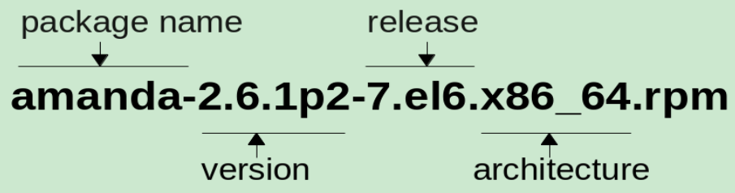

# [从 0 到 1] - RPM 与 YUM

---

> **何为 [从 0 到 1]** : 即 从对某个知识 **一知半解** 或 **一无所知** 的状态，到 **理解基本概念** 且 **了解基本使用** 的状态。

## 前言

### 本文适合的人群

了解 Linux 的简单命令，但对 RPM 与 YUM 一知半解或一无所知的同志。

### 为什么有这篇文章

最近搞了台云服务器，准备自己折腾一下，发现自己并不了解 RPM 和 YUM 。

于是，开始在网上搜索一些教程进行学习。但是，我发现很多中文教程并不让我满意，要么是直接上来就告诉你有哪些命令，要么是告诉你怎么制作 RPM 包。其实对于初学者来讲，更需要的是了解相关概念，这样就不会脑子一团浆糊，只知道复制命令执行了。

所以，我查了一些资料，整理出了此文。笔者水平有限，如有错漏之处，还望不吝赐教。

**PS: 同志们有什么好的相关学习资源，可以分享一下。**

## 什么是 RPM

### 一句话解释

是一款 Linux 系统使用的包管理工具。

### 名称由来

原全称为 `Red Hat Package Manager` (因为最初是为 Red Hat 系列 Linux 开发的)，后来由于一些非 Red Hat 系列的 Linux 发行版本也在使用 RPM，所以把全称改为了 `RPM Package Manager` ([递归缩写 (Recursive acronym)](https://zh.wikipedia.org/zh-cn/%E9%80%92%E5%BD%92%E7%BC%A9%E5%86%99)) 。

### 使用 RPM 的系统

- Red Hat 系列。如 Fedora 、 CentOS 
- SUSE 系列。
- ……

## 什么是 RPM Package File

RPM Package ，即，可以使用 RPM 安装的一个个软件 (或称为包)。

我们知道，Windows 安装软件时，需要先下载一个安装包文件，然后通过这个文件进行安装；

类似地，使用 RPM 安装软件，也需要通过一个包文件，称为 RPM Package File ，使用 rpm 命令安装时，需要指定这个文件的位置 (可以是本地路径，也可以是 url 地址)。

以 `amanda-2.6.1p2-7.el6.x86_64.rpm` 为例



`release` 是打包者添加的发布信息。

这里的 `7` 表示这个包发布了 7 次 (可能要修复 bug)

`el6` 表示 **Red Hat Enterprise Linux 6** 。


## 如何使用 RPM


## RPM 的缺点

在安装一个包时，如果这个包依赖其他的包，RPM 无法帮忙安装这些依赖，它只会把所有依赖列出来。(因为像上面说的，安装时，必须指定 Package File 的路径， RPM 无法知道这些依赖对应的 Package File 在哪)


## 什么是 YUM

### 一句话解释

YUM 是一款基于 RPM 的更强大的 **包管理工具** 。

### YUM 与 RPM 有什么不同之处

- YUM 会自动安装 RPM package 所需要的依赖，
- YUM 提供了插件接口，可以通过插件增强 YUM 的功能。


## 什么是 repo


## 什么是 yum-utils

### 一句话解释

yum-utils 是 YUM 官方提供的增强 YUM 的工具集，通过命令行可以使用相关工具。

### YUM Utils 列表

参见  [Yum Utils 列表](http://yum.baseurl.org/wiki/YumUtils.html) 查看 yum-utils 中都包含了哪些工具。

### 如何安装 yum-utils

执行 yum 命令: `yum install -y yum-utils`

###  yum-utils 之 yumdownloader

从 YUM Repo 下载 RPM Package File 到本地的工具。

命令格式: `yumdownloader [options] package1 [package2...]`

```sh
# 下载 nginx 包到指定目录
yumdownloader --destdir /var/tmp nginx

# 查询 nginx 包所在的地址
yumdownloader --urls nginx
```


## TD

1. 红帽系列系统是否默认安装 RPM 与 YUM？如果不是，是否需要写一下如何安装 RPM 与 YUM。
2. epoch 是啥？


---

## 参考

1. [RPM 官网](https://rpm.org/index.html)
2. [rpm_tutorial_20120831.pdf](https://access.redhat.com/sites/default/files/attachments/rpm_tutorial_20120831.pdf)
   - 注意: **INVESTIGATING RPM PACKAGES** 一节中，执行 `yumdownloader amanda-2*` 可能无法下载 amanda，因为可能没有指定 repo ，YUM 找不到这个包。
   - 注意: **USING THE RPM COMMAND** 一节中使用的 `rpm -qp --checksig amanda-2.6.1p2-7.el6.x86_64.rpm` 命令在 **RPM version 4.11.3** 无法正常执行，改成 `rpm --checksig amanda-2.6.1p2-7.el6.x86_64.rpm` 后可正常执行。
3. [Linux 发行版本](https://upload.wikimedia.org/wikipedia/commons/1/1b/Linux_Distribution_Timeline.svg)
4. [YUM 官网](http://yum.baseurl.org/)

